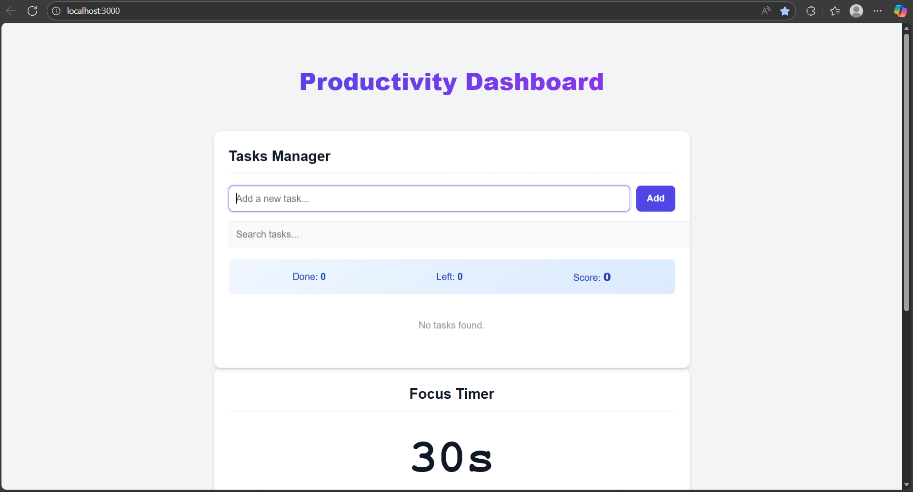

# 📝 Todo List
> **Streamline your day with a simple, elegant task manager.**

[](https://react.dev/)
[](https://vitejs.dev/)
[](https://tailwindcss.com/)
[](LICENSE)

<br />

<div align="center">
  <a href="YOUR_DEPLOYMENT_LINK_HERE">
    
  </a>
  <br />

  **[View Live Demo](YOUR_DEPLOYMENT_LINK_HERE)** · **[Report Bug](YOUR_REPO_URL/issues)** · **[Request Feature](YOUR_REPO_URL/issues)**
</div>

<br />

## 💡 About

Built with modern React, **Todo List** is designed to help you organize your tasks efficiently without the clutter. Whether you're managing daily chores or a project roadmap, this app provides a clean interface to capture, prioritize, and track your progress.

It leverages **Local Storage** to ensure your tasks remain safe even if you refresh the page, offering a seamless user experience without the need for a backend.

## ✨ Features

*   **📝 Smart Task Management** — Create, edit, and delete tasks instantly.
*   **✅ Status Tracking** — Mark items as complete with a satisfying toggle.
*   **🔍 Advanced Filtering** — View specific lists: `All`, `Active`, or `Completed`.
*   **💾 Data Persistence** — Tasks are automatically saved to your browser's Local Storage.
*   **🌙 Dark Mode Support** — A beautiful interface that adapts to your system theme.
*   **🎨 Responsive Design** — Works perfectly on desktop, tablet, and mobile.

## 🚀 Quick Start

Get the project up and running on your local machine in minutes.

### Prerequisites

Ensure you have [Node.js](https://nodejs.org/) installed.

### Installation

1.  **Clone the repository**
    ```bash
    git clone https://github.com/your-username/todo-list.git
    cd todo-list
    ```

2.  **Install dependencies**
    ```bash
    npm install
    # or
    yarn install
    ```

3.  **Start the development server**
    ```bash
    npm start
    ```

The app should now be running at `http://localhost:3000` (or a similar port).

## 🛠️ Available Scripts

Here are the most common scripts you'll need during development:

| Script | Description |
| :--- | :--- |
| `npm run dev` | Starts the development server with hot module replacement. |
| `npm run build` | Builds the app for production to the `dist` folder. |
| `npm run preview` | Locally previews the production build. |
| `npm run lint` | Runs ESLint to check for code quality issues. |

## 📂 Project Structure

A quick look at the top-level files and directories you'll see in this project.

```text
.
├── public/              # Static assets (favicons, logos)
├── src/
│   ├── components/      # Reusable UI components (Header, TodoItem, Filters)
│   ├── hooks/           # Custom React hooks (e.g., useLocalStorage)
│   ├── styles/          # Global CSS or Tailwind configurations
│   ├── App.jsx          # Main application logic
│   └── main.jsx         # Entry point
├── package.json         # Project dependencies and scripts
└── README.md            # Project documentation
```

## 🤝 Contributing

Contributions make the open-source community such an amazing place to learn, inspire, and create. Any contributions you make are **greatly appreciated**.

1.  Fork the Project
2.  Create your Feature Branch (`git checkout -b feat/AmazingFeature`)
3.  Commit your Changes (`git commit -m 'Add some AmazingFeature'`)
4.  Push to the Branch (`git push origin feat/AmazingFeature`)
5.  Open a Pull Request

## 📄 License

Distributed under the MIT License. See `LICENSE` for more information.

***

<div align="center">
  <p>Built with ❤️ by <a href="https://github.com/0xsaksham">Saksham Gupta</a></p>
</div>
